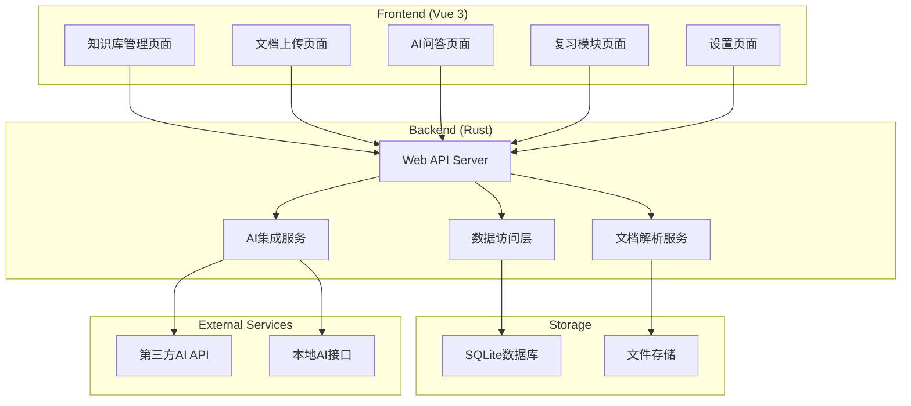

# Design Document

## Overview

知识积累系统采用前后端分离架构，前端使用Vue 3构建响应式Web界面，后端使用Rust构建高性能API服务。系统支持多知识库管理、文档解析、AI集成和学习复习功能。

## Architecture

### 系统架构图



### 技术栈

**前端:**
- Vue 3 + Vue Router + Vuex
- Axios (HTTP客户端)
- Element Plus (UI组件库)
- File Upload组件

**后端:**
- Rust + Tokio (异步运行时)
- Axum (Web框架)
- SQLx (数据库访问)
- Serde (序列化/反序列化)

**数据存储:**
- SQLite (主数据库)
- 本地文件系统 (文档存储)

**文档解析:**
- pdf-extract (PDF解析)
- epub (EPUB解析)
- 标准文件I/O (TXT解析)

## Components and Interfaces

### Frontend Components

#### 1. 知识库管理组件 (KnowledgeBaseManager)
```typescript
interface KnowledgeBase {
  id: string;
  name: string;
  description: string;
  created_at: string;
  updated_at: string;
  document_count: number;
}

// API接口
- GET /api/knowledge-bases - 获取知识库列表
- POST /api/knowledge-bases - 创建知识库
- PUT /api/knowledge-bases/:id - 更新知识库
- DELETE /api/knowledge-bases/:id - 删除知识库
```

#### 2. 文档管理组件 (DocumentManager)
```typescript
interface Document {
  id: string;
  knowledge_base_id: string;
  filename: string;
  file_type: 'pdf' | 'epub' | 'txt';
  file_size: number;
  content_preview: string;
  upload_date: string;
}

// API接口
- GET /api/knowledge-bases/:id/documents - 获取文档列表
- POST /api/knowledge-bases/:id/documents - 上传文档
- DELETE /api/documents/:id - 删除文档
```

#### 3. AI问答组件 (AIQuizComponent)
```typescript
interface Question {
  id: string;
  knowledge_base_id: string;
  question_text: string;
  generated_at: string;
}

interface Answer {
  id: string;
  question_id: string;
  user_answer: string;
  ai_evaluation: {
    score: number;
    feedback: string;
    suggestions: string[];
  };
  answered_at: string;
}

// API接口
- POST /api/knowledge-bases/:id/generate-question - 生成问题
- POST /api/questions/:id/answer - 提交答案
```

#### 4. 复习模块组件 (ReviewComponent)
```typescript
interface ReviewSession {
  id: string;
  knowledge_base_id: string;
  questions_reviewed: number;
  average_score: number;
  session_date: string;
}

// API接口
- GET /api/knowledge-bases/:id/review/random - 获取随机复习问题
- GET /api/knowledge-bases/:id/history - 获取历史记录
- POST /api/review-sessions - 创建复习会话
```

#### 5. AI配置组件 (AIConfigComponent)
```typescript
interface AIConfig {
  provider: 'deepseek' | 'local' | 'openai';
  api_key?: string;
  api_url?: string;
  model_name?: string;
  max_tokens: number;
  temperature: number;
}

// API接口
- GET /api/ai-config - 获取AI配置
- POST /api/ai-config - 保存AI配置
- POST /api/ai-config/test - 测试AI连接
```

### Backend Services

#### 1. Web API Server (main.rs)
```rust
use axum::{
    routing::{get, post, put, delete},
    Router,
};

// 路由配置
async fn create_app() -> Router {
    Router::new()
        .route("/api/knowledge-bases", get(list_knowledge_bases).post(create_knowledge_base))
        .route("/api/knowledge-bases/:id", put(update_knowledge_base).delete(delete_knowledge_base))
        .route("/api/knowledge-bases/:id/documents", get(list_documents).post(upload_document))
        .route("/api/documents/:id", delete(delete_document))
        .route("/api/knowledge-bases/:id/generate-question", post(generate_question))
        .route("/api/questions/:id/answer", post(submit_answer))
        .route("/api/ai-config", get(get_ai_config).post(save_ai_config))
        .route("/api/ai-config/test", post(test_ai_connection))
}
```

#### 2. 文档解析服务 (document_parser.rs)
```rust
pub trait DocumentParser {
    async fn parse(&self, file_path: &str) -> Result<String, ParseError>;
}

pub struct PdfParser;
pub struct EpubParser;
pub struct TxtParser;

impl DocumentParser for PdfParser {
    async fn parse(&self, file_path: &str) -> Result<String, ParseError> {
        // PDF解析逻辑
    }
}
```

#### 3. AI集成服务 (ai_service.rs)
```rust
pub trait AIProvider {
    async fn generate_question(&self, context: &str) -> Result<String, AIError>;
    async fn evaluate_answer(&self, question: &str, answer: &str, context: &str) -> Result<Evaluation, AIError>;
}

pub struct DeepSeekProvider {
    api_key: String,
    client: reqwest::Client,
}

pub struct LocalAIProvider {
    api_url: String,
    client: reqwest::Client,
}
```

#### 4. 数据访问层 (database.rs)
```rust
use sqlx::{SqlitePool, Row};

pub struct DatabaseManager {
    pool: SqlitePool,
}

impl DatabaseManager {
    pub async fn create_knowledge_base(&self, name: &str, description: &str) -> Result<String, sqlx::Error>;
    pub async fn get_knowledge_bases(&self) -> Result<Vec<KnowledgeBase>, sqlx::Error>;
    pub async fn save_document(&self, document: &Document) -> Result<(), sqlx::Error>;
    pub async fn save_question_answer(&self, qa: &QuestionAnswer) -> Result<(), sqlx::Error>;
}
```

## Data Models

### 数据库Schema

```sql
-- 知识库表
CREATE TABLE knowledge_bases (
    id TEXT PRIMARY KEY,
    name TEXT NOT NULL,
    description TEXT,
    created_at DATETIME DEFAULT CURRENT_TIMESTAMP,
    updated_at DATETIME DEFAULT CURRENT_TIMESTAMP
);

-- 文档表
CREATE TABLE documents (
    id TEXT PRIMARY KEY,
    knowledge_base_id TEXT NOT NULL,
    filename TEXT NOT NULL,
    file_type TEXT NOT NULL,
    file_path TEXT NOT NULL,
    file_size INTEGER NOT NULL,
    content_text TEXT,
    upload_date DATETIME DEFAULT CURRENT_TIMESTAMP,
    FOREIGN KEY (knowledge_base_id) REFERENCES knowledge_bases(id) ON DELETE CASCADE
);

-- 问题表
CREATE TABLE questions (
    id TEXT PRIMARY KEY,
    knowledge_base_id TEXT NOT NULL,
    question_text TEXT NOT NULL,
    context_snippet TEXT,
    generated_at DATETIME DEFAULT CURRENT_TIMESTAMP,
    FOREIGN KEY (knowledge_base_id) REFERENCES knowledge_bases(id) ON DELETE CASCADE
);

-- 答案表
CREATE TABLE answers (
    id TEXT PRIMARY KEY,
    question_id TEXT NOT NULL,
    user_answer TEXT NOT NULL,
    ai_score INTEGER,
    ai_feedback TEXT,
    ai_suggestions TEXT,
    answered_at DATETIME DEFAULT CURRENT_TIMESTAMP,
    FOREIGN KEY (question_id) REFERENCES questions(id) ON DELETE CASCADE
);

-- 复习会话表
CREATE TABLE review_sessions (
    id TEXT PRIMARY KEY,
    knowledge_base_id TEXT NOT NULL,
    questions_count INTEGER NOT NULL,
    average_score REAL,
    session_date DATETIME DEFAULT CURRENT_TIMESTAMP,
    FOREIGN KEY (knowledge_base_id) REFERENCES knowledge_bases(id) ON DELETE CASCADE
);

-- AI配置表
CREATE TABLE ai_config (
    id INTEGER PRIMARY KEY,
    provider TEXT NOT NULL,
    api_key TEXT,
    api_url TEXT,
    model_name TEXT,
    max_tokens INTEGER DEFAULT 1000,
    temperature REAL DEFAULT 0.7,
    updated_at DATETIME DEFAULT CURRENT_TIMESTAMP
);
```

## Error Handling

### 错误类型定义

```rust
#[derive(Debug, thiserror::Error)]
pub enum AppError {
    #[error("数据库错误: {0}")]
    Database(#[from] sqlx::Error),
    
    #[error("文件解析错误: {0}")]
    DocumentParse(String),
    
    #[error("AI服务错误: {0}")]
    AIService(String),
    
    #[error("文件上传错误: {0}")]
    FileUpload(String),
    
    #[error("配置错误: {0}")]
    Config(String),
    
    #[error("验证错误: {0}")]
    Validation(String),
}

impl IntoResponse for AppError {
    fn into_response(self) -> Response {
        let (status, error_message) = match self {
            AppError::Database(_) => (StatusCode::INTERNAL_SERVER_ERROR, "数据库操作失败"),
            AppError::DocumentParse(_) => (StatusCode::BAD_REQUEST, "文档解析失败"),
            AppError::AIService(_) => (StatusCode::SERVICE_UNAVAILABLE, "AI服务不可用"),
            AppError::FileUpload(_) => (StatusCode::BAD_REQUEST, "文件上传失败"),
            AppError::Config(_) => (StatusCode::BAD_REQUEST, "配置错误"),
            AppError::Validation(_) => (StatusCode::BAD_REQUEST, "输入验证失败"),
        };
        
        let body = Json(json!({
            "error": error_message,
            "details": self.to_string()
        }));
        
        (status, body).into_response()
    }
}
```

### 前端错误处理

```typescript
// API错误处理
class APIError extends Error {
  constructor(public status: number, public message: string, public details?: string) {
    super(message);
  }
}

// 全局错误处理器
const handleAPIError = (error: APIError) => {
  switch (error.status) {
    case 400:
      ElMessage.error(`输入错误: ${error.message}`);
      break;
    case 500:
      ElMessage.error('服务器内部错误，请稍后重试');
      break;
    case 503:
      ElMessage.error('AI服务暂时不可用');
      break;
    default:
      ElMessage.error(`未知错误: ${error.message}`);
  }
};
```

## Testing Strategy

### 单元测试

**后端测试 (Rust)**
```rust
#[cfg(test)]
mod tests {
    use super::*;
    
    #[tokio::test]
    async fn test_pdf_parser() {
        let parser = PdfParser::new();
        let result = parser.parse("test.pdf").await;
        assert!(result.is_ok());
    }
    
    #[tokio::test]
    async fn test_ai_question_generation() {
        let ai_service = MockAIService::new();
        let question = ai_service.generate_question("test context").await;
        assert!(question.is_ok());
    }
}
```

**前端测试 (Vue Test Utils)**
```typescript
import { mount } from '@vue/test-utils'
import KnowledgeBaseManager from '@/components/KnowledgeBaseManager.vue'

describe('KnowledgeBaseManager', () => {
  it('should display knowledge bases list', async () => {
    const wrapper = mount(KnowledgeBaseManager)
    // 测试逻辑
  })
})
```

### 集成测试

```rust
#[tokio::test]
async fn test_full_workflow() {
    // 1. 创建知识库
    // 2. 上传文档
    // 3. 生成问题
    // 4. 提交答案
    // 5. 验证结果
}
```

### 性能测试

- 文档解析性能测试（大文件处理）
- AI API响应时间测试
- 数据库查询性能测试
- 前端组件渲染性能测试

## Security Considerations

1. **API密钥安全**: AI API密钥加密存储，不在日志中记录
2. **文件上传安全**: 限制文件类型和大小，扫描恶意内容
3. **输入验证**: 所有用户输入进行严格验证和清理
4. **CORS配置**: 正确配置跨域访问策略
5. **错误信息**: 避免在错误消息中泄露敏感信息